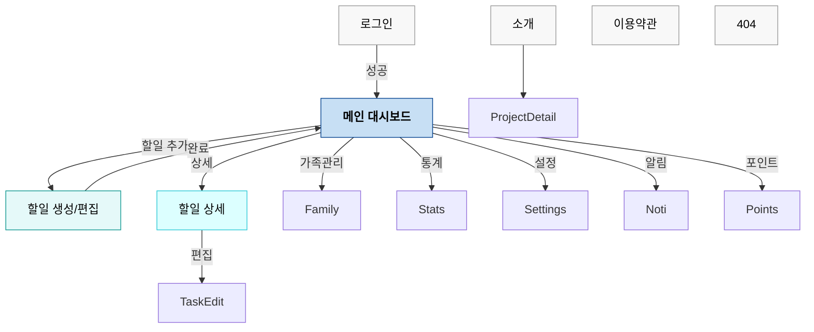

📋 Moonwave Plan 화면정의서 v2.0 (코드 동기화 100%)

---

## 📋 목차
1. [프로젝트 개요](#📖-프로젝트-개요)
2. [데이터 구조](#📊-데이터-구조)
3. [라우팅/네비게이션](#🧭-라우팅네비게이션)
4. [화면 구조도](#🏗️-화면-구조도)
5. [화면별 상세 정의](#🎯-화면별-상세-정의)
   - 5.1. [메인 화면 (Home)](#1-메인-화면-home)
   - 5.2. [할일 생성/편집 (TaskCreate)](#2-할일-생성편집-taskcreate)
   - 5.3. [할일 상세 (TaskDetail)](#3-할일-상세-taskdetail)
   - 5.4. [가족 관리 (FamilyManage)](#4-가족-관리-familymanage)
   - 5.5. [통계 (Statistics)](#5-통계-statistics)
   - 5.6. [설정 (Settings)](#6-설정-settings)
   - 5.7. [로그인/회원가입 (Login)](#7-로그인회원가입-login)
   - 5.8. [알림 센터 (Notifications)](#8-알림-센터-notifications)
   - 5.9. [포인트 관리 (PointsManagement)](#9-포인트-관리-pointsmanagement)
   - 5.10. [소개 (AboutUs)](#10-소개-aboutus)
   - 5.11. [이용약관 (TermsOfService)](#11-이용약관-termsofservice)
   - 5.12. [프로젝트 상세 (ProjectDetail)](#12-프로젝트-상세-projectdetail)
   - 5.13. [404 페이지 (NotFound)](#13-404-페이지-notfound)
6. [공통 레이아웃/컴포넌트](#🧩-공통-레이아웃컴포넌트)
7. [상태 관리/로딩/에러 패턴](#🔄-상태-관리로딩에러-패턴)
8. [반응형/접근성](#📱-반응형접근성)
9. [성능/코드스플리팅](#⚡-성능코드스플리팅)
10. [PWA](#📱-pwa)
11. [버전 정보](#📌-버전-정보)

---

## 📖 프로젝트 개요

### 프로젝트 정보
- 프로젝트명: Moonwave Plan (Family Task Manager)
- 도메인: https://plan.moonwave.kr
- 기술 스택: React 18 + Vite + Tailwind CSS + Radix UI + Firebase (Auth/Firestore/Storage)
- 배포: Vercel
- 서비스 타입: 정적 SPA + PWA

### 핵심 컨셉
"가족과 함께하는 스마트한 할일 관리" — 가족 구성원이 함께 할일을 생성/공유/완료하고, 포인트·통계로 동기부여하는 협업형 일정 관리 서비스

### 주요 기능
- 할일: 생성/편집/삭제/완료, 우선순위/카테고리/태그/반복/알림/첨부/URL/위치
- 그룹: 생성/초대(코드/QR/이메일)/역할(그룹장/부그룹장/관리자/멤버/뷰어), 멤버 통계, 채팅(전체화면)
- 통계: 기간/그룹/멤버 기준 차트 및 랭킹, 카테고리 분포, 업적/인사이트
- 알림: 타입·상태 필터, 읽음/삭제, 일상적 시간 표현
- 포인트: 미승인/승인 내역, 수동 추가/차감, AI 분석/승인, 권한 기반 제어
- 설정: 프로필/알림/프라이버시/데이터(백업·내보내기·가져오기·초기화)
- 공개 페이지: 소개/About, 이용약관/개인정보, 프로젝트 상세

---

## 📊 데이터 구조

### Firestore 주요 컬렉션 (개요)
```
groups/{groupId}
  info, settings, statistics, inviteCode
  members/{memberId}

tasks/{taskId}
  info, comments/{commentId}, activities

users/{userId}
  profile, settings

notifications/{notificationId}
points/{pointId}
```

### 핵심 타입 (요약)
```ts
type TaskStatus = 'pending' | 'in_progress' | 'completed'
type TaskPriority = 'low' | 'medium' | 'high'
type TaskCategory = string

interface FileAttachment { id; fileName; fileSize; mimeType; storageUrl; downloadUrl?; uploadedBy; uploadedAt; thumbnailUrl?; isImage; width?; height? }
interface UrlAttachment { id; url; title?; description?; thumbnailUrl?; domain?; addedBy; addedAt }
interface Reminder { id; time; method: 'push'|'email'|'both'; sent? }
interface RecurringConfig { enabled; frequency: 'daily'|'weekly'|'monthly'|'yearly'; interval; endDate?; daysOfWeek?; dayOfMonth? }
interface TaskLocation { lat; lng; address? }

interface Task {
  id; taskType: 'personal'|'group'; groupId?; userId; assigneeId; assigneeName?;
  title; description?; status; priority; category;
  dueDate?; estimatedMinutes?; actualMinutes?; recurring?; tags: string[];
  attachments?; urls?; location?; completedAt?; completedBy?; completionNotes?;
  watchers: string[]; mentionedUsers: string[]; reminders: Reminder[];
  commentCount?; isStarred?; version; archivedAt?; createdAt; updatedAt;
}
```

---

## 🧭 라우팅/네비게이션

### 라우트 테이블 (코드 동기화)
| 경로 | 화면 | 인증 | 컴포넌트 |
|---|---|---|---|
| `/` | 메인(Home) | 필요 | `TodoHome` |
| `/todo` | 메인(Home 별칭) | 필요 | `TodoHome` |
| `/tasks/create` | 할일 생성 | 필요 | `TaskCreate`(mode=create) |
| `/tasks/:taskId/edit` | 할일 편집 | 필요 | `TaskCreate`(mode=edit) |
| `/tasks/:taskId` | 할일 상세 | 필요 | `TaskDetailPage` |
| `/family` | 가족 관리 | 필요 | `FamilyManage` |
| `/points` | 포인트 관리 | 필요 | `PointsManagement` |
| `/statistics` | 통계 | 필요 | `Statistics` |
| `/settings` | 설정 | 필요 | `Settings` |
| `/notifications` | 알림 | 필요 | `Notifications` |
| `/login` | 로그인/회원가입 | 불필요 | `Login` |
| `/about` | 소개 | 불필요 | `AboutUs` |
| `/terms-of-service` | 이용약관/개인정보 | 불필요 | `TermsOfService` |
| `/project-detail/:projectId` | 프로젝트 상세 | 불필요 | `ProjectDetail` |
| `*` | 404 | - | `NotFound` |

### 인증/가드
- ProtectedRoute: 미인증 시 기본 리다이렉트 `/login`. 로그인 상태에서 `/login` 접근 시 `/`로 이동.
- 상단 고정 헤더는 공개/인증 페이지에서 상황에 따라 표시(`ConditionalHeader`).

---

## 🏗️ 화면 구조도



---

## 🎯 화면별 상세 정의

### 1. 메인 화면 (Home)
- 화면 ID: HOME-001
- 경로: `/`, `/todo`
- 목적: 오늘/이번주/전체 기준 할일 현황 파악, 빠른 추가, 상태/통계 확인

레이아웃 요약
```
헤더(고정) → 히어로(브랜드/버전/인사말/날짜/로그아웃)
가시성 필터(개인/그룹/전체) + 시간 필터(전체/오늘/이번주)
요약 통계(전체/완료/진행/지연, 완료율 바)
빠른 추가(QuickAddTask)
할일 목록(TaskCard 목록) + 빈 상태 가이드
지연된 할일 섹션(필터 반영)
캘린더 섹션(일정 선택/할일 추가)
```

주요 요소/동작
- 필터: `taskVisibility(personal|group|all)`, `viewFilter(all|today|week)`
- 빠른 추가: 제목/옵션 파싱 → `createTask` 호출, 컨텍스트에 따라 groupId 결정
- 할일 카드: 완료 토글, 상세 이동, 수정/삭제, 링크 공유, 스와이프 지원(모바일)
- 지연 섹션: 진행중이며 기한 경과 항목을 별도 강조
- 캘린더: 날짜 선택 시 `viewFilter=all` 유지, [+]로 생성 페이지 이동
- 상태: 로딩(스피너), 에러(아이콘/재시도), 빈 상태(가이드/스크롤 이동)
- 접근성: 버튼 aria-label, 초점 상태, 키보드 내비게이션 지원

빈/에러/로딩 상태
- 로딩: "할일 목록을 불러오는 중..."
- 에러: 경고 카드 + 다시 시도
- 빈 상태: 필터 텍스트 동적 반영 + 가이드 토글(사용법 예시)

반응형
- 모바일: 하단 버튼군 축소, 날짜/필터가 카드형으로 재배치
- 데스크톱: 통계 4그리드, 넓은 여백과 확장 텍스트

---

### 2. 할일 생성/편집 (TaskCreate)
- 화면 ID: CREATE-001
- 경로: `/tasks/create`, `/tasks/:taskId/edit`
- 목적: 새 할일 생성 또는 기존 할일 수정

입력 필드/규칙
- 유형: 개인/그룹 (그룹 없음이면 개인 자동 전환)
- 그룹 선택: 그룹 목록에서 선택(선택 시 담당자 초기화)
- 담당자: 개인=본인, 그룹=그룹 멤버 중 1명 필수
- 기본: 제목(필수)/설명/우선순위/카테고리/태그
- 일정: 마감일/시간(선택), 미리보기
- 반복: 사용 여부 토글, 주기(daily/weekly/monthly/yearly), 간격, 종료일
- 알림: 사전 셋(10분/30분/1시간/1일/1주), 복수 선택/삭제/전체삭제
- 추가: 예상 소요 시간(분)/위치/첨부파일/URL

검증/동작
- 필수: 제목, (그룹일 때) 담당자
- 저장 시: 날짜/시간 결합, reminders 매핑(id/time/method)
- 편집 모드: 기존 Task → 폼 맵핑(마감일/시간 분리), 반복/알림 반영
- 저장 결과: 생성/수정 후 뒤로 이동

상태/UX
- 저장 버튼 상단 고정, 로딩 시 스피너
- 그룹이 없으면 안내 카드(가족관리로 이동 버튼)
- 오류는 인라인 캡션(빨강) 및 스낵바 대체 가능한 알림 문구

---

### 3. 할일 상세 (TaskDetail)
- 화면 ID: DETAIL-001
- 경로: `/tasks/:taskId`
- 목적: 할일 정보/타임라인/댓글/첨부/URL 확인 및 상태/편집/삭제

구성
- 헤더: 아이콘/제목/생성일, [수정]/[삭제](권한: 작성자/담당자), 모바일 Back
- 상태 버튼: 대기/진행/완료 토글(실시간 반영/로딩 보호)
- 태그/완료 정보: 완료일/완료 메모
- 댓글/활동: 댓글 작성/삭제/반응, 활동 로그
- 사이드 정보: 유형/그룹/담당자/마감일/위치/반복/예상시간
- 첨부/URL: 썸네일/파일명/용량/다운로드, 링크 타이틀/설명/도메인
- 빠른 작업: [수정], [복제(예약)], [알림 설정(예약)]

상태/빈 화면
- taskId 없음/에러/로딩별 고지 + 홈 이동/재시도

권한
- 편집/삭제: `user.uid === task.userId || user.uid === task.assigneeId`

---

### 4. 가족 관리 (FamilyManage)
- 화면 ID: FAMILY-001
- 경로: `/family`
- 목적: 그룹 선택/생성/초대/가입, 멤버 관리(역할/제거/통계), 채팅

그룹/역할
- 역할: `owner`(그룹장), `vice_owner`(부그룹장), `admin`, `member`, `viewer`
- 권한 요약:
  - 초대/설정/멤버 관리/삭제: 그룹장, (일부)부그룹장/관리자
  - 포인트 승인/차감: 그룹장/부그룹장

주요 기능
- 그룹 선택: 즐겨찾기 우선 정렬(로컬 저장), 선택 시 데이터 갱신
- 초대: 초대 코드 복사/QR 표시/QR 스캔/이메일 초대(역할 지정)
- 설정: 자녀 초대 허용, 승인 필요, 부그룹장 활성화, 포인트관리, 최대 멤버, 온라인 최적화
- 멤버 카드: 역할/이메일/온라인/최근 로그인, 빠른 역할 변경/양도/편집/제거
- 통계 요약: 생성/할당/완료/완료율/포인트(클릭 시 상세)
- 할일 목록: 그룹 기준 페이지네이션(5개/페이지) + 상세 이동
- 채팅: `GroupChat` 섹션 + 전체화면 모달 토글(ESC 닫기)

모달 목록
- 새 그룹 만들기, 멤버 초대, 그룹 설정, 그룹 편집, 멤버 편집, QR 초대, QR 스캔, 전체화면 채팅

온라인 상태
- 현재 사용자 메타데이터/Firestore 백업/로컬 캐시 기반 점검(최적화 모드)

상태/가드
- 그룹 미선택/미존재: 안내 카드 + 새 그룹/QR 참여 버튼
- 로딩/에러: 스피너/알림

---

### 5. 통계 (Statistics)
- 화면 ID: STATS-001
- 경로: `/statistics`
- 목적: 할일/포인트의 기간/그룹/멤버별 성과 가시화, 업적/AI 인사이트

필터/선택
- 그룹 선택: 즐겨찾기 우선, 기본 첫 그룹 자동선택
- 기간: 7일/30일/3개월/연간

차트/지표
- 일별 완료 현황(실데이터): 생성/완료 건수 Bar
- 카테고리 분포: 파이(%)
- 주차 비교: 4주 비교(완료/목표)
- 멤버 성과: 각 멤버 완료/전체/완료율 카드+아바타
- 그룹 통계: 완료율/활성 멤버/평균 성과/총 포인트
- 포인트 통계: 멤버별 총/획득/차감, 순위표
- 업적: 연속완료/월간100개/팀워크/지연없이30개
- AI 인사이트(조건부): `StatisticsInsights` 노출

상태
- 로딩/데이터 없음 처리 각 섹션별 문구 제공

---

### 6. 설정 (Settings)
- 화면 ID: SETTINGS-001
- 경로: `/settings`
- 목적: 사용자 프로필/알림/프라이버시/데이터 관리

탭 구성 (`SettingsContainer`)
1) 프로필(ProfileSection)
   - 필드: 이름, 이메일(읽기), 전화번호, 위치, 자기소개, 아바타 업로드/삭제
   - 편집 토글, 단일 필드 저장/전체 저장, 검증/오류 인라인 표시
   - 프로필 완성도 게이지 + 미완료 항목 바로가기
2) 알림(NotificationSection)
   - 권한 요청(브라우저), 채널: 푸시/인앱 토글, 유형: 리마인더/할당/완료/댓글/초대/업데이트/주간/일일
   - 타이밍: 방해금지(시작/종료), 리마인더 타이밍(즉시/5/15/30/1h)
   - 소리/진동: 활성/볼륨/진동
   - 테스트 알림
3) 프라이버시(PrivacySection)
   - 프로필/통계/활동 공개 범위 토글
   - 보안/정책 정보 및 정책 전문 버튼
4) 데이터(DataSection)
   - 백업: 자동 백업(주기: 주간/월간), 수동 백업, 상태 메시지, (목록/복원/삭제)
   - 내보내기/가져오기(JSON), 전체 초기화(2중 확인), 로그아웃

상태
- 로딩: "설정을 불러오는 중..." / 에러 시 재시도
- 상단 고정 저장 버튼(페이지 모드)

---

### 7. 로그인/회원가입 (Login)
- 화면 ID: LOGIN-001
- 경로: `/login`
- 목적: 이메일/비밀번호 로그인/회원가입, 비밀번호 재설정, Google/익명 로그인

구성
- 탭: [로그인]/[회원가입] 토글
- 입력: (가입) 이름/이메일/비밀번호/확인, (로그인) 이메일/비밀번호/표시 토글
- 버튼: Google로 로그인, 익명 시작, 제출, (로그인 모드) 비밀번호 재설정 링크

검증/흐름
- 가입: 이름 필수, 비밀번호 ≥ 6자, 비밀번호 일치
- 에러: Firebase 코드별 한글화 메시지
- 성공 시 `/` 이동

---

### 8. 알림 센터 (Notifications)
- 화면 ID: NOTI-001
- 경로: `/notifications`
- 목적: 알림 목록 확인/필터/읽음/삭제

필터/정렬
- 상태: 전체/읽지 않음/읽음
- 타입: 전체/task/group/system/reminder

목록 항목
- 아이콘(타입)/제목/메시지/생성일(오늘/어제/N일 전/월-일)
- 우선순위 배지: high/medium/low 색상
- 타입 배지: 할일/그룹/시스템/리마인더
- 액션: 단건 읽음, 삭제 / 상단 모두 읽음

상태
- 로딩/에러/빈 목록 메시지

---

### 9. 포인트 관리 (PointsManagement)
- 화면 ID: POINTS-001
- 경로: `/points`
- 목적: 그룹/멤버 포인트 내역 관리, 승인/거부, 수동 조정, AI 분석, 통계/랭킹

권한
- 승인/거부/수동 조정: 그룹장(owner), 부그룹장(vice_owner)만

구성
- 상단: 그룹 선택(즐겨찾기), 가이드, (권한 시) 설정 버튼
- 좌측: 구성원 목록(나 우선 정렬, 총 포인트 표시)
- 우측: 선택 멤버 상세(총/획득/차감/보너스/순위) + 빠른 버튼(추가/차감)
- 미승인 내역: 항목 클릭 시 할일 편집 이동, [승인]/[거부], (가능 시) AI 분석→조정 승인
- 승인 내역: 최신 5개 + 전체 모달
- 포인트 설정/설명/작업 상세/AI 분석: 모달

수동 조정
- 모달: 수량/사유, 현재/적용 후 포인트 미리보기, 확인/취소

상태
- 그룹 미선택, 멤버 미선택, 로딩/빈 목록/에러 각각 안내

---

### 10. 소개 (AboutUs)
- 화면 ID: ABOUT-001
- 경로: `/about`
- 목적: Moonwave Plan 철학, 가치, 프로젝트, 기술, 연락처

섹션
- Hero(브랜드/철학 문구), About, Philosophy(Wave/Flow), Values 카드, Projects 카드(내부 상세/외부 링크), Technology, Contact
- 프로젝트 카드: 내부 이동 `/project-detail/:projectId`, 외부 `https://{url}` 새창

---

### 11. 이용약관 (TermsOfService)
- 화면 ID: TERMS-001
- 경로: `/terms-of-service`
- 목적: 서비스 이용약관/개인정보처리방침/면책/문의

구성
- Hero(로고/타이틀/아이콘 요약)
- 약관: 목적/정의/효력/제공/이용/저작권/책임제한/분쟁
- 개인정보처리방침: 처리자/수집 항목/목적/보유기간/제3자 제공/안전성/권리/쿠키/변경
- 면책, 문의(운영자/연락처/웹사이트), 푸터 카피라이트

---

### 12. 프로젝트 상세 (ProjectDetail)
- 화면 ID: PROJ-001
- 경로: `/project-detail/:projectId`
- 목적: 소개 페이지의 각 프로젝트 상세 정보/기능/기술/상태/출시정보

구성
- 존재하지 않을 경우: 안내 카드 + `/about`로 이동 버튼
- 상세: Hero(이름/설명/상태/출시예정), 개요, 기능 목록, 사용 기술 태그, 문의/방문 버튼

---

### 13. 404 페이지 (NotFound)
- 화면 ID: NOTFOUND-001
- 경로: `*`
- 목적: 잘못된 경로 안내 및 대체 이동 경로 제공

구성/동작
- 404 애니메이션, 홈/이전 버튼, 도움 링크(소개/설정/이용약관)

---

## 🧩 공통 레이아웃/컴포넌트

레이아웃/네비게이션
- 고정 헤더(`Header`): 좌측 홈, 우측 알림/할일추가/가족관리/포인트/통계/설정. 현재 경로 활성 표시/알림 뱃지.
- 푸터(`Footer`), 배경(`WaveBackground`), 조건부 헤더(`ConditionalHeader`).

주요 컴포넌트 (요약)
- GlassCard: 유리 효과 카드(variant: default|light|medium|strong)
- WaveButton: 프라이머리/세컨더리/고스트, 사이즈/아이콘 조합
- TaskCard: 우선순위/카테고리/담당/기한/태그/링크/공유/편집/삭제/완료 토글, 스와이프(모바일)
- QuickAddTask: 제목 입력+Enter/버튼으로 빠른 생성, 그룹/담당자 프리셋
- TaskDetail: 댓글/활동/첨부/URL 렌더링 및 콜백
- SettingsNavigation/Content: 탭 헤더, 섹션 렌더링

모달/시트
- 포인트: 설정/설명/작업 상세/AI 분석
- 가족: 초대/스캔/그룹/멤버 편집/생성, 채팅 전체화면

접근성 공통
- aria-label/role/aria-checked/switch 패턴, 키보드 포커스 링, 최소 터치 타겟(모바일)

---

## 🔄 상태 관리/로딩/에러 패턴
- 전역 컨텍스트: `AppProvider`, `DataProvider`, `TaskProvider`
- Firebase 실시간 구독: 그룹/할일/알림 등 onSnapshot 패턴
- 로딩: 페이지 중앙 스피너(텍스트 포함)
- 에러: 카드형 경고 + 재시도 버튼/네비게이션 대안
- 빈 상태: 친화적 안내/행동 유도 버튼/예시

---

## 📱 반응형/접근성
- 브레이크포인트: 모바일(~640)/태블릿(≥640)/데스크톱(≥1024)
- 모바일 최적화: 스와이프 완료/하단 시트/고정 헤더 간격 클래스(`fixed-header-spacing`)
- 접근성: ARIA 속성, 라이브 영역, 포커스 관리, 고대비/큰 글씨 고려

---

## ⚡ 성능/코드스플리팅
- 라우트 지연 로딩: `lazy(() => import(...))`
- 중복 렌더 최소화: React.memo/의존성 정제
- 리스트: 키/조건부 렌더링/필터 계산 useMemo

---

## 📱 PWA
- Service Worker: 프로덕션 로드시 등록(`sw.js`)
- Manifest(아이콘/테마/standalone)
- 목표: 오프라인 캐싱/백그라운드 동기/푸시(FCM) 확장 가능

---

## 📌 버전 정보
- 문서 버전: v2.0
- 기준 코드: `src/App.tsx` 라우트 및 각 페이지/컴포넌트
- 동기화 포인트:
  - 라우트/가드/네비게이션 최신 반영
  - 포인트/가족/설정/알림/통계/소개/약관/프로젝트/404 포함, 누락 없음
  - 폼 필드/검증/권한/모달/상태/반응형/접근성/성능 지침 포함

부록: 빠른 체크리스트
- [ ] 모든 라우트 접근 경로 존재/활성 링크 동작
- [ ] 생성/편집/상세 흐름 정상(권한/검증 포함)
- [ ] 그룹 초대/역할/설정/채팅 모달 동작
- [ ] 포인트 승인/차감/AI 분석/설명/설정 모달 동작(권한)
- [ ] 알림 필터/읽음/삭제
- [ ] 통계 차트/필터/업적/포인트 순위
- [ ] 설정 4탭 저장/권한/백업/내보내기/가져오기/초기화
- [ ] 공개 페이지(소개/약관/프로젝트)/404 네비게이션
